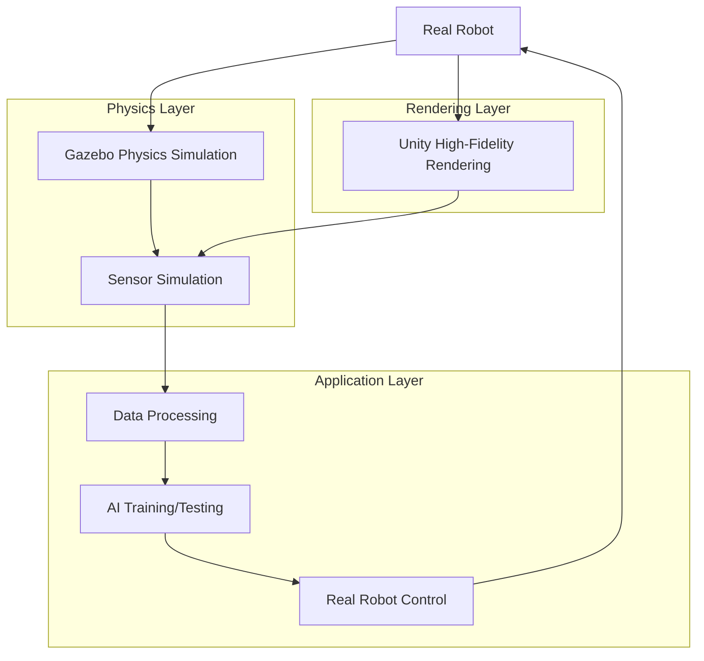

# Module 2: Digital Twin Simulation

## Overview

This module covers digital twin environments using Gazebo for physics simulation and Unity for high-fidelity rendering. Students will learn about physics simulation with realistic gravity and collision properties, high-fidelity digital twin creation, and sensor simulation for LiDAR, depth cameras, and IMUs.

## Learning Objectives

Upon completion of this module, students will be able to:
- Set up physics-based simulation environments in Gazebo with proper gravity and collision detection
- Create high-fidelity digital twin environments in Unity with accurate rendering and interaction
- Simulate various sensors (LiDAR, depth cameras, IMUs) in both Gazebo and Unity environments
- Understand how digital twins support humanoid robotics applications

## Module Structure

This module is organized into the following sections:
1. [Gazebo Physics](./gazebo-physics.md) - Gravity, collisions, and robot-environment behavior
2. [Unity Digital Twin](./unity-digital-twin.md) - Rendering, interaction, and scene setup
3. [Sensor Simulation](./sensor-simulation.md) - LiDAR, depth cameras, and IMU simulation

## Prerequisites

- Understanding of basic physics concepts (gravity, forces, collisions)
- Familiarity with 3D modeling and rendering concepts
- Basic knowledge of sensor types and their applications in robotics

## Simulation Workflow

The digital twin simulation workflow connects physics simulation with high-fidelity rendering:

## Next Steps

Begin with the [Gazebo Physics](./gazebo-physics.md) section to understand physics simulation fundamentals.