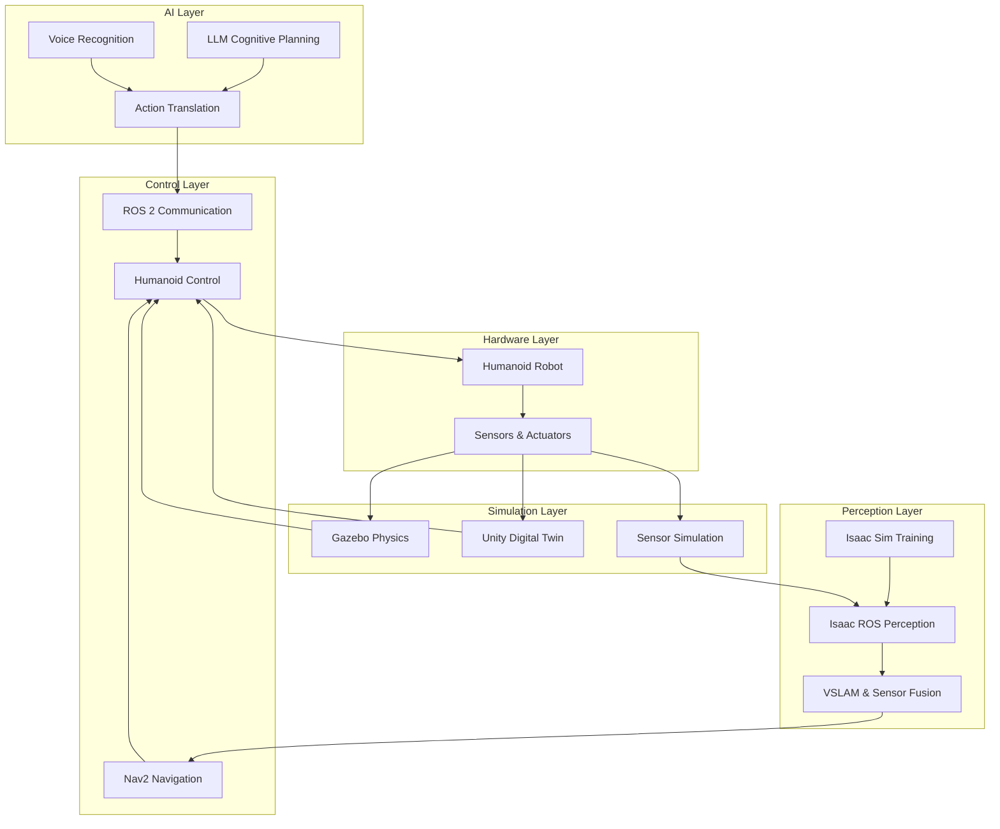

# Physical AI & Humanoid Robotics

## Welcome to the Physical AI & Humanoid Robotics Book

This comprehensive resource covers end-to-end humanoid robotics education, from foundational ROS 2 concepts to advanced Vision-Language-Action systems. Designed for intermediate to advanced AI/robotics students, this book provides accurate, doc-verified explanations for all ROS 2, Gazebo, Unity, Isaac, and VLA workflows.

## Learning Path

We recommend following these modules in order to build your knowledge progressively:

### [Module 1: ROS 2 Foundations](./ros2-foundations/index.md)
- Foundations of the Robotic Nervous System
- Communication in ROS 2 (Nodes, Topics, Services)
- Bridging AI Agents to Robots + URDF for Humanoids

### [Module 2: Digital Twin Simulation](./digital-twin/index.md)
- Gazebo Physics — gravity, collisions, robot–environment behavior
- Unity Digital Twin — rendering, interaction, scene setup
- Sensor Simulation — LiDAR, Depth Cameras, IMUs

### [Module 3: AI-Robot Brain (NVIDIA Isaac)](./isaac-sim/index.md)
- Isaac Sim — photorealism, synthetic data, training pipelines
- Isaac ROS — VSLAM, perception modules, sensor fusion
- Nav2 — path planning, navigation stack for bipedal robots

### [Module 4: Vision-Language-Action (VLA) System](./vla-system/index.md)
- Voice-to-Action — Using Whisper to convert speech → structured commands
- Cognitive Planning — LLMs translating natural language → ROS 2 action plans
- Capstone: The Autonomous Humanoid — voice → plan → navigate → detect → manipulate

## System Architecture

The Physical AI & Humanoid Robotics system integrates multiple technologies across the entire robotics stack:

## About this Book

This AI/Spec-Driven Book + RAG Chatbot provides:
- Accurate, doc-verified explanations for all workflows
- Each chapter includes diagrams, workflows, and runnable code snippets
- Deep understanding of middleware, simulation, perception, and autonomous pipelines
- RAG Chatbot that answers only from book content

## Prerequisites

- Intermediate programming skills in Python
- Basic understanding of robotics concepts
- Familiarity with ROS 2 (Robot Operating System)
- Understanding of AI/ML concepts

## Next Steps

Begin with [Module 1: ROS 2 Foundations](./ros2-foundations/index.md) to understand the robotic nervous system concepts.