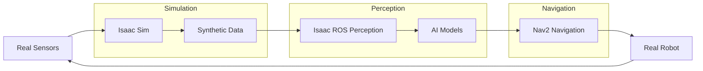

# Module 3: AI-Robot Brain (NVIDIA Isaac)

## Overview

This module covers NVIDIA Isaac technologies for robotics, including Isaac Sim for photorealistic simulation, Isaac ROS for accelerated perception, and Nav2 for humanoid navigation. Students will learn how to leverage GPU acceleration for robotics perception and navigation, with special focus on humanoid robot applications.

## Learning Objectives

Upon completion of this module, students will be able to:
- Set up and use Isaac Sim for photorealistic simulation and synthetic data generation
- Implement accelerated perception using Isaac ROS packages
- Configure Nav2 for humanoid robot navigation with balance preservation
- Understand how AI perception integrates with robot motion planning

## Module Structure

This module is organized into the following sections:
1. [Isaac Sim](./isaac-sim.md) - Photorealistic simulation and synthetic data generation
2. [Isaac ROS](./isaac-ros.md) - Accelerated perception and VSLAM
3. [Nav2 for Humanoids](./nav2-humanoid.md) - Path planning for bipedal robots

## Prerequisites

- Understanding of basic ROS 2 concepts
- Knowledge of computer vision and perception
- Basic understanding of navigation concepts
- GPU computing fundamentals

## Isaac Pipeline

The Isaac platform provides a comprehensive pipeline for accelerated robotics:

## Next Steps

Begin with the [Isaac Sim](./isaac-sim.md) section to understand photorealistic simulation fundamentals.