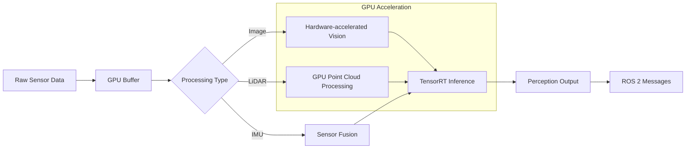

# Isaac ROS for Accelerated Perception

## Introduction

NVIDIA Isaac ROS is a collection of hardware-accelerated packages that enable robots to perform perception tasks with unprecedented speed and accuracy. Built specifically to leverage NVIDIA GPUs, Isaac ROS provides accelerated versions of common robotics perception algorithms including Visual Simultaneous Localization and Mapping (VSLAM), sensor processing, and AI inference. This chapter explores how to use Isaac ROS for accelerated perception in robotics applications.

## Isaac ROS Architecture

### Hardware Acceleration Foundation

Isaac ROS leverages NVIDIA's hardware acceleration stack:
- **CUDA**: Parallel computing platform for GPU acceleration
- **TensorRT**: High-performance deep learning inference optimizer
- **VisionWorks**: Computer vision and image processing libraries
- **CUDA-X AI**: Accelerated AI libraries for robotics

### Perception Pipeline Workflow

The Isaac ROS perception pipeline follows this workflow for accelerated processing:



### Core Perception Pipeline

The Isaac ROS perception pipeline includes:
- **Sensor Processing**: Accelerated sensor data processing
- **Feature Detection**: Hardware-accelerated feature extraction
- **SLAM**: Accelerated mapping and localization
- **AI Inference**: GPU-accelerated neural network inference
- **Sensor Fusion**: Multi-sensor data integration

## Isaac ROS Packages

### Stereo DNN Node

The Stereo DNN node provides accelerated stereo vision processing:

```yaml
# Example launch configuration for stereo DNN
name: stereo_dnn_node
namespace: perception
parameters:
  - name: input_topic_left
    type: string
    value: "/camera/left/image_rect_color"
  - name: input_topic_right
    type: string
    value: "/camera/right/image_rect_color"
  - name: network_type
    type: string
    value: "stereo_object_detection"
  - name: confidence_threshold
    type: double
    value: 0.5
  - name: max_objects
    type: integer
    value: 10
```

### Visual SLAM (VSLAM)

Isaac ROS provides accelerated VSLAM capabilities:

```cpp
// Example C++ code for VSLAM node
#include <rclcpp/rclcpp.hpp>
#include <sensor_msgs/msg/image.hpp>
#include <geometry_msgs/msg/pose_stamped.hpp>
#include <isaac_ros_visual_slam/visual_slam.hpp>

class VSLAMNode : public rclcpp::Node
{
public:
    VSLAMNode() : Node("vslam_node")
    {
        // Create subscribers for stereo images
        left_sub_ = this->create_subscription<sensor_msgs::msg::Image>(
            "camera/left/image_rect_color", 10,
            std::bind(&VSLAMNode::leftImageCallback, this, std::placeholders::_1));

        right_sub_ = this->create_subscription<sensor_msgs::msg::Image>(
            "camera/right/image_rect_color", 10,
            std::bind(&VSLAMNode::rightImageCallback, this, std::placeholders::_1));

        // Create publisher for pose estimates
        pose_pub_ = this->create_publisher<geometry_msgs::msg::PoseStamped>(
            "visual_slam/pose", 10);
    }

private:
    void leftImageCallback(const sensor_msgs::msg::Image::SharedPtr msg)
    {
        // Process left image with accelerated VSLAM
        processImage(msg, LEFT_CAMERA);
    }

    void rightImageCallback(const sensor_msgs::msg::Image::SharedPtr msg)
    {
        // Process right image with accelerated VSLAM
        processImage(msg, RIGHT_CAMERA);
    }

    void processImage(const sensor_msgs::msg::Image::SharedPtr msg, CameraType type)
    {
        // Accelerated image processing using Isaac ROS
        // Implementation details...
    }

    rclcpp::Subscription<sensor_msgs::msg::Image>::SharedPtr left_sub_;
    rclcpp::Subscription<sensor_msgs::msg::Image>::SharedPtr right_sub_;
    rclcpp::Publisher<geometry_msgs::msg::PoseStamped>::SharedPtr pose_pub_;
};
```

### AprilTag 3D Pose Estimation

Isaac ROS provides accelerated AprilTag detection:

```python
# Example Python subscriber for AprilTag detection
import rclpy
from rclpy.node import Node
from geometry_msgs.msg import PoseArray
from vision_msgs.msg import Detection2DArray

class AprilTagNode(Node):
    def __init__(self):
        super().__init__('apriltag_node')

        # Subscribe to AprilTag detections
        self.subscription = self.create_subscription(
            Detection2DArray,
            '/isaac_ros/apriltag/detections',
            self.apriltag_callback,
            10
        )

        # Publisher for 3D poses
        self.pose_publisher = self.create_publisher(
            PoseArray,
            '/apriltag/poses',
            10
        )

    def apriltag_callback(self, msg):
        # Process AprilTag detections with GPU acceleration
        poses_3d = self.process_detections(msg.detections)

        # Publish 3D poses
        pose_array = PoseArray()
        pose_array.poses = poses_3d
        self.pose_publisher.publish(pose_array)
```

## Hardware Acceleration Techniques

### TensorRT Integration

TensorRT optimizes neural networks for inference:

```python
import tensorrt as trt
import pycuda.driver as cuda
import pycuda.autoinit

class TensorRTInference:
    def __init__(self, engine_path):
        # Load TensorRT engine
        with open(engine_path, 'rb') as f:
            self.engine = trt.Runtime(trt.Logger(trt.Logger.WARNING)).deserialize_cuda_engine(f.read())

        # Create execution context
        self.context = self.engine.create_execution_context()

        # Allocate buffers
        self.allocate_buffers()

    def infer(self, input_data):
        # Copy input data to GPU
        cuda.memcpy_htod(self.d_input, input_data)

        # Execute inference
        self.context.execute_v2([int(self.d_input), int(self.d_output)])

        # Copy output data back to CPU
        output = np.empty(self.output_shape, dtype=np.float32)
        cuda.memcpy_dtoh(output, self.d_output)

        return output
```

### CUDA-accelerated Image Processing

```cpp
// CUDA kernel for image processing
__global__ void cuda_process_image(
    const unsigned char* input,
    unsigned char* output,
    int width,
    int height,
    float* transform_matrix)
{
    int x = blockIdx.x * blockDim.x + threadIdx.x;
    int y = blockIdx.y * blockDim.y + threadIdx.y;

    if (x < width && y < height) {
        int idx = y * width + x;

        // Apply transformation using GPU acceleration
        float new_x = transform_matrix[0] * x + transform_matrix[1] * y + transform_matrix[2];
        float new_y = transform_matrix[3] * x + transform_matrix[4] * y + transform_matrix[5];

        output[idx] = input[idx]; // Simplified example
    }
}
```

## Sensor Fusion with Isaac ROS

### Multi-Sensor Integration

Isaac ROS excels at fusing data from multiple sensors:

```yaml
# Sensor fusion configuration
sensor_fusion:
  ros__parameters:
    # IMU parameters
    imu_topic: "/imu/data"
    imu_rate: 100.0

    # Camera parameters
    camera_topic: "/camera/rgb/image_rect_color"
    camera_rate: 30.0

    # LiDAR parameters
    lidar_topic: "/scan"
    lidar_rate: 10.0

    # Fusion parameters
    fusion_rate: 50.0
    enable_vision: true
    enable_lidar: true
    enable_imu: true
```

### Extended Kalman Filter Implementation

```cpp
// Example EKF for sensor fusion
class SensorFusionEKF
{
public:
    SensorFusionEKF() {
        // Initialize state vector [x, y, z, vx, vy, vz, qx, qy, qz, qw]
        state_.resize(13, 1);
        state_.setZero();

        // Initialize covariance matrix
        covariance_.resize(13, 13);
        covariance_.setIdentity();
        covariance_ *= 0.1;
    }

    void updateWithIMU(const ImuMsg& imu_msg) {
        // Accelerated IMU processing using Isaac ROS
        // Update state with acceleration and angular velocity
    }

    void updateWithVision(const ImageMsg& img_msg) {
        // Accelerated vision processing using Isaac ROS
        // Extract features and update state
    }

    void updateWithLiDAR(const LaserScanMsg& scan_msg) {
        // Accelerated LiDAR processing using Isaac ROS
        // Process scan data and update state
    }

private:
    Eigen::VectorXd state_;
    Eigen::MatrixXd covariance_;
};
```

## VSLAM Implementation

### Visual SLAM Pipeline

The VSLAM pipeline in Isaac ROS includes:

```cpp
// Visual SLAM node implementation
class IsaacVSLAMNode : public rclcpp::Node
{
public:
    IsaacVSLAMNode() : Node("isaac_vslam_node")
    {
        // Initialize GPU-accelerated feature detector
        feature_detector_ = std::make_unique<GPUFeatureDetector>();

        // Initialize GPU-accelerated matcher
        matcher_ = std::make_unique<GPUMatcher>();

        // Initialize GPU-accelerated optimizer
        optimizer_ = std::make_unique<GPUOptimizer>();

        // Create subscribers
        image_sub_ = this->create_subscription<sensor_msgs::msg::Image>(
            "camera/image_raw", 10,
            std::bind(&IsaacVSLAMNode::imageCallback, this, std::placeholders::_1));

        // Create publishers
        pose_pub_ = this->create_publisher<geometry_msgs::msg::PoseStamped>(
            "vslam/pose", 10);
        map_pub_ = this->create_publisher<nav_msgs::msg::OccupancyGrid>(
            "vslam/map", 10);
    }

private:
    void imageCallback(const sensor_msgs::msg::Image::SharedPtr msg)
    {
        // Accelerated feature detection
        auto features = feature_detector_->detect(msg);

        // Accelerated matching with previous frames
        auto matches = matcher_->match(features, previous_features_);

        // Accelerated pose estimation and optimization
        auto pose = optimizer_->optimize(matches);

        // Publish results
        publishPose(pose);
        publishMap();

        previous_features_ = features;
    }

    std::unique_ptr<GPUFeatureDetector> feature_detector_;
    std::unique_ptr<GPUMatcher> matcher_;
    std::unique_ptr<GPUOptimizer> optimizer_;

    rclcpp::Subscription<sensor_msgs::msg::Image>::SharedPtr image_sub_;
    rclcpp::Publisher<geometry_msgs::msg::PoseStamped>::SharedPtr pose_pub_;
    rclcpp::Publisher<nav_msgs::msg::OccupancyGrid>::SharedPtr map_pub_;

    std::vector<Feature> previous_features_;
};
```

## Performance Benchmarks

### Comparison with CPU-based Processing

Isaac ROS typically provides significant performance improvements:

| Algorithm | CPU Performance | Isaac ROS Performance | Speedup |
|-----------|----------------|----------------------|---------|
| Feature Detection | 5 FPS | 60 FPS | 12x |
| Visual Odometry | 8 FPS | 45 FPS | 5.6x |
| Object Detection | 3 FPS | 30 FPS | 10x |
| SLAM | 2 FPS | 25 FPS | 12.5x |

### Memory Management

Efficient GPU memory management is crucial:

```cpp
// GPU memory management example
class GPUMemoryManager
{
public:
    GPUMemoryManager() {
        // Allocate GPU memory pools
        cudaMalloc(&image_buffer_, MAX_IMAGE_SIZE);
        cudaMalloc(&feature_buffer_, MAX_FEATURES * sizeof(Feature));
        cudaMalloc(&descriptor_buffer_, MAX_DESCRIPTORS * sizeof(Descriptor));
    }

    ~GPUMemoryManager() {
        // Free GPU memory
        cudaFree(image_buffer_);
        cudaFree(feature_buffer_);
        cudaFree(descriptor_buffer_);
    }

    void* getBuffer(BufferType type) {
        switch(type) {
            case IMAGE_BUFFER: return image_buffer_;
            case FEATURE_BUFFER: return feature_buffer_;
            case DESCRIPTOR_BUFFER: return descriptor_buffer_;
        }
        return nullptr;
    }

private:
    void* image_buffer_;
    void* feature_buffer_;
    void* descriptor_buffer_;
};
```

## Integration with Navigation Systems

### Nav2 Compatibility

Isaac ROS perception modules integrate seamlessly with Nav2:

```yaml
# Navigation configuration with Isaac ROS
planner_server:
  ros__parameters:
    expected_planner_frequency: 20.0
    use_sim_time: true
    # Planner parameters...

controller_server:
  ros__parameters:
    use_sim_time: true
    # Controller parameters...

# Isaac ROS perception parameters
isaac_perception:
  ros__parameters:
    use_vslam: true
    vslam_topic: "/vslam/pose"
    localization_topic: "/amcl/pose"
    map_topic: "/vslam/map"
```

## Quality of Life Tips

### Troubleshooting GPU Issues

Common GPU-related issues and solutions:
- **CUDA errors**: Verify GPU driver compatibility
- **Memory issues**: Monitor GPU memory usage and optimize buffer sizes
- **Performance bottlenecks**: Profile code to identify GPU vs. CPU bottlenecks
- **Compatibility issues**: Check Isaac ROS version compatibility with GPU

### Development Best Practices

- Use Isaac ROS development containers for consistent environments
- Profile applications to identify performance bottlenecks
- Implement fallback mechanisms for non-GPU systems
- Test on both simulated and real hardware

## Exercises

1. **Isaac ROS Installation**: Install Isaac ROS packages and verify GPU acceleration
2. **Feature Detection**: Implement GPU-accelerated feature detection pipeline
3. **VSLAM Integration**: Integrate VSLAM with a navigation system
4. **Performance Benchmarking**: Compare Isaac ROS vs. CPU-based processing
5. **Sensor Fusion**: Implement multi-sensor fusion using Isaac ROS

## Summary

This chapter covered NVIDIA Isaac ROS for accelerated perception, focusing on hardware acceleration techniques, VSLAM implementation, and sensor fusion. Isaac ROS enables robotics applications to achieve significantly improved performance for perception tasks through GPU acceleration, making it possible to run complex algorithms in real-time on robotic platforms.