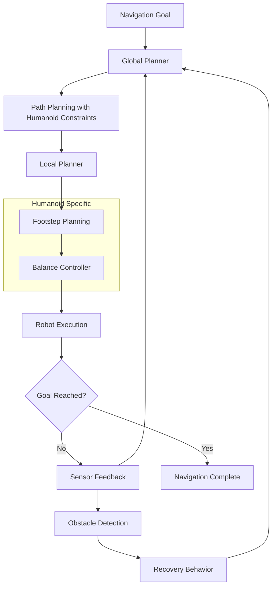

# Nav2 for Humanoid Navigation

## Introduction

Navigation is a fundamental capability for mobile robots, and Nav2 (Navigation 2) provides a comprehensive framework for path planning and navigation. For humanoid robots, navigation presents unique challenges due to bipedal locomotion, balance requirements, and complex kinematics. This chapter explores how to configure and use Nav2 specifically for humanoid robot navigation, addressing the unique challenges of bipedal locomotion.

### Navigation System Workflow

The Nav2 navigation system for humanoid robots follows this workflow:



## Nav2 Architecture Overview

### Core Components

Nav2 consists of several key components:
- **Navigation Server**: Central coordinator for navigation tasks
- **Planner Server**: Global path planning (A*, Dijkstra, etc.)
- **Controller Server**: Local path following and obstacle avoidance
- **Recovery Server**: Behavior trees for navigation recovery
- **Lifecycle Manager**: Manages component lifecycles

### Humanoid-Specific Considerations

Humanoid robots require special navigation considerations:
- **Balance preservation**: Path planning must account for stability
- **Step constraints**: Limited step size and direction for bipedal locomotion
- **ZMP (Zero Moment Point)**: Maintain balance during movement
- **Footstep planning**: Generate stable footstep sequences

## Nav2 Configuration for Humanoids

### Parameter Configuration

```yaml
# Nav2 configuration for humanoid robot
bt_navigator:
  ros__parameters:
    use_sim_time: True
    global_frame: map
    robot_base_frame: base_link
    odom_topic: /odom
    bt_loop_duration: 10
    default_server_timeout: 20
    # Specify the custom behavior tree for humanoid navigation
    default_nav_to_pose_bt_xml: /path/to/humanoid_nav_to_pose.xml
    default_nav_through_poses_bt_xml: /path/to/humanoid_nav_through_poses.xml

planner_server:
  ros__parameters:
    use_sim_time: True
    planner_plugins: ["GridBased"]
    GridBased:
      plugin: "nav2_navfn_planner/NavfnPlanner"
      tolerance: 0.5
      use_astar: false
      allow_unknown: true
      # Humanoid-specific parameters
      step_size: 0.3  # Maximum step size for humanoid
      min_distance_from_robot: 0.5  # Safety margin for humanoid

controller_server:
  ros__parameters:
    use_sim_time: True
    controller_frequency: 20.0
    min_x_velocity_threshold: 0.05
    min_y_velocity_threshold: 0.05
    min_theta_velocity_threshold: 0.1
    # Humanoid-specific velocity limits
    x_velocity_limit: 0.3    # Slower for stability
    y_velocity_limit: 0.2
    theta_velocity_limit: 0.5
    progress_checker_plugin: "progress_checker"
    goal_checker_plugin: "goal_checker"
    controller_plugins: ["FollowPath"]

    # Humanoid path follower
    FollowPath:
      plugin: "nav2_mppi_controller/MPPICController"
      time_steps: 32
      control_frequency: 20.0
      prediction_horizon: 1.6
      # Humanoid-specific parameters
      discretization: 0.1
      acceleration_lim: [2.0, 2.0, 3.14]
      # Slower acceleration for stability
      vx_reg_reference: 0.3
      vy_reg_reference: 0.2
      wz_reg_reference: 0.5
```

## Humanoid-Specific Navigation Challenges

### Balance and Stability

Humanoid robots must maintain balance during navigation:
- **ZMP (Zero Moment Point)**: Critical for stable walking
- **COM (Center of Mass)**: Must be maintained within support polygon
- **Foot placement**: Strategic placement for balance recovery
- **Walking gait**: Maintaining stable gait patterns during navigation

### Kinematic Constraints

Bipedal robots have unique kinematic constraints:
- **Limited step size**: Cannot step arbitrarily far
- **Step timing**: Precise timing for stable locomotion
- **Joint limits**: Hip, knee, and ankle constraints
- **Ankle compliance**: Need for compliant ankle control

## Footstep Planning Integration

### Footstep Planner Node

```cpp
// Example footstep planner for humanoid navigation
#include <rclcpp/rclcpp.hpp>
#include <nav_msgs/msg/path.hpp>
#include <geometry_msgs/msg/pose_stamped.hpp>

class FootstepPlanner : public rclcpp::Node
{
public:
    FootstepPlanner() : Node("footstep_planner")
    {
        // Subscribe to global path
        global_path_sub_ = this->create_subscription<nav_msgs::msg::Path>(
            "global_plan", 10,
            std::bind(&FootstepPlanner::globalPathCallback, this, std::placeholders::_1));

        // Publish footstep plan
        footstep_pub_ = this->create_publisher<nav_msgs::msg::Path>(
            "footstep_plan", 10);
    }

private:
    void globalPathCallback(const nav_msgs::msg::Path::SharedPtr msg)
    {
        // Convert global path to footstep plan
        auto footstep_plan = generateFootsteps(*msg);
        footstep_pub_->publish(footstep_plan);
    }

    nav_msgs::msg::Path generateFootsteps(const nav_msgs::msg::Path& path)
    {
        nav_msgs::msg::Path footstep_plan;
        footstep_plan.header = path.header;

        // Generate footsteps based on path and humanoid constraints
        for (size_t i = 0; i < path.poses.size(); i += 2) {
            geometry_msgs::msg::PoseStamped left_foot, right_foot;

            // Calculate left foot position
            left_foot.pose = path.poses[i].pose;
            left_foot.pose.position.y += 0.1;  // Offset for left foot

            // Calculate right foot position
            if (i + 1 < path.poses.size()) {
                right_foot.pose = path.poses[i + 1].pose;
                right_foot.pose.position.y -= 0.1;  // Offset for right foot
            }

            footstep_plan.poses.push_back(left_foot);
            if (i + 1 < path.poses.size()) {
                footstep_plan.poses.push_back(right_foot);
            }
        }

        return footstep_plan;
    }

    rclcpp::Subscription<nav_msgs::msg::Path>::SharedPtr global_path_sub_;
    rclcpp::Publisher<nav_msgs::msg::Path>::SharedPtr footstep_pub_;
};
```

### Integration with Navigation Stack

Footstep planning integrates with Nav2 through custom plugins:

```python
# Python example of footstep integration
import rclpy
from rclpy.node import Node
from nav2_core.local_planner import LocalPlanner
from geometry_msgs.msg import PoseStamped
from nav_msgs.msg import Path
import numpy as np

class HumanoidLocalPlanner(LocalPlanner):
    def __init__(self):
        super().__init__()
        self.footstep_generator = FootstepGenerator()
        self.balance_controller = BalanceController()

    def setPlan(self, path):
        # Convert navigation path to footstep plan
        self.footstep_plan = self.footstep_generator.generate_from_path(path)
        return True

    def computeVelocityCommands(self, pose, velocity, goal_checker):
        # Generate footstep-based velocity commands
        footstep_cmd = self.footstep_generator.get_next_footstep()
        velocity_cmd = self.balance_controller.compute_velocity(
            pose, footstep_cmd, velocity)
        return velocity_cmd

    def isGoalReached(self):
        # Check if goal is reached based on footstep plan
        return self.footstep_generator.is_complete()
```

## Behavior Trees for Humanoid Navigation

### Custom Behavior Tree Nodes

```xml
<!-- Custom behavior tree for humanoid navigation -->
<root main_tree_to_execute="MainTree">
    <BehaviorTree ID="MainTree">
        <ReactiveSequence name="NavigateWithHumanoid">
            <GoalUpdated/>
            <ClearEntirelyLocalCostmap name="ClearLocalCostmap-1"/>
            <ComputePathToPoseGoalUpdated name="ComputePathToPose"/>
            <SmoothPath name="SmoothPath"/>
            <ConvertToFootsteps name="PathToFootsteps"/>
            <FollowFootsteps name="FollowFootsteps"/>
            <IsGoalReached name="IsGoalReached"/>
        </ReactiveSequence>
    </BehaviorTree>

    <BehaviorTree ID="RecoveryNode">
        <ReactiveFallback name="RecoveryFallback">
            <BackUpAndTurn name="BackupAndTurn"/>
            <Spin name="Spin"/>
            <Wait name="Wait"/>
        </ReactiveFallback>
    </BehaviorTree>
</root>
```

### Recovery Behaviors for Humanoids

```yaml
# Recovery behaviors for humanoid robots
recovery_server:
  ros__parameters:
    use_sim_time: True
    recovery_plugins: ["spin", "backup", "wait"]
    spin:
      plugin: "nav2_recoveries/Spin"
      # Slower spinning for humanoid stability
      spin_dist: 1.57
      time_allowance: 20.0
    backup:
      plugin: "nav2_recoveries/BackUp"
      # Shorter backup distance for humanoid
      backup_dist: 0.3
      backup_speed: 0.05
      time_allowance: 10.0
    wait:
      plugin: "nav2_recoveries/Wait"
      # Wait time for humanoid balance recovery
      wait_duration: 2.0
```

## Navigation with Isaac ROS Integration

### Perception-Enhanced Navigation

Integrating Isaac ROS perception with Nav2:

```yaml
# Navigation configuration with Isaac ROS perception
isaac_nav2_integration:
  ros__parameters:
    use_sim_time: True
    # Perception parameters from Isaac ROS
    perception_topic: "/isaac_ros/detections"
    # Navigation parameters
    navigation_topic: "/navigate_to_pose"
    # Fusion parameters
    detection_timeout: 5.0
    min_detection_confidence: 0.7
    # Humanoid-specific navigation parameters
    perception_aware_navigation: True
    dynamic_obstacle_avoidance: True
    safety_margin: 0.8  # Larger margin for humanoid safety
```

### Dynamic Obstacle Avoidance

```cpp
// Dynamic obstacle avoidance for humanoid navigation
class HumanoidObstacleAvoidance
{
public:
    HumanoidObstacleAvoidance() {
        // Initialize humanoid-specific avoidance parameters
        max_step_size_ = 0.3;  // Limited step size
        reaction_time_ = 0.5;  // Time to react to obstacles
        safety_margin_ = 0.5;  // Safety distance
    }

    geometry_msgs::msg::Twist computeAvoidanceCommand(
        const sensor_msgs::msg::LaserScan& scan,
        const geometry_msgs::msg::Twist& desired_cmd)
    {
        geometry_msgs::msg::Twist avoidance_cmd = desired_cmd;

        // Find nearest obstacle
        float min_distance = std::numeric_limits<float>::max();
        int min_index = 0;

        for (size_t i = 0; i < scan.ranges.size(); ++i) {
            if (scan.ranges[i] < min_distance && scan.ranges[i] > 0.1) {
                min_distance = scan.ranges[i];
                min_index = i;
            }
        }

        // If obstacle is too close, slow down or stop
        if (min_distance < safety_margin_) {
            // Calculate avoidance direction
            float angle = scan.angle_min + min_index * scan.angle_increment;

            // Adjust velocity based on humanoid constraints
            avoidance_cmd.linear.x = std::min(desired_cmd.linear.x * 0.3, 0.1f);
            avoidance_cmd.angular.z = desired_cmd.angular.z +
                (angle > 0 ? -0.2 : 0.2);  // Turn away from obstacle
        }

        return avoidance_cmd;
    }

private:
    float max_step_size_;
    float reaction_time_;
    float safety_margin_;
};
```

## Performance Optimization for Humanoids

### Computational Efficiency

Humanoid navigation requires careful computational management:
- **Predictive planning**: Pre-calculate footsteps when possible
- **Balance optimization**: Efficient balance control algorithms
- **Sensor fusion**: Optimize sensor data processing
- **Real-time constraints**: Maintain timing requirements for stability

### Memory Management

```cpp
// Memory-efficient humanoid navigation data structures
class HumanoidNavigationMemory
{
public:
    HumanoidNavigationMemory(size_t max_footsteps = 100)
        : max_footsteps_(max_footsteps) {
        // Pre-allocate memory for footstep planning
        footsteps_.reserve(max_footsteps);
        support_polygons_.reserve(max_footsteps);
    }

    void reset() {
        footsteps_.clear();
        support_polygons_.clear();
    }

private:
    size_t max_footsteps_;
    std::vector<Footstep> footsteps_;
    std::vector<SupportPolygon> support_polygons_;
};
```

## Quality of Life Tips

### Debugging Navigation Issues

Common humanoid navigation debugging approaches:
- **RViz visualization**: Monitor footstep plans and ZMP
- **Balance monitoring**: Track COM and ZMP during navigation
- **Step timing**: Verify proper gait timing
- **Sensor validation**: Ensure perception data is accurate

### Configuration Best Practices

- Start with conservative parameters for stability
- Gradually increase speed and agility as needed
- Test on simple paths before complex navigation
- Validate balance control during navigation

## Exercises

1. **Nav2 Configuration**: Configure Nav2 for a humanoid robot model
2. **Footstep Planning**: Implement a basic footstep planner
3. **Balance Integration**: Integrate balance control with navigation
4. **Isaac ROS Integration**: Connect Isaac ROS perception with Nav2
5. **Behavior Tree Creation**: Create custom behavior trees for humanoid navigation

## Summary

This chapter covered Nav2 configuration and usage specifically for humanoid robots, addressing the unique challenges of bipedal locomotion, balance preservation, and footstep planning. Humanoid navigation requires special considerations compared to wheeled robots, including step constraints, balance maintenance, and gait planning, all of which have been addressed in this chapter with practical examples and configuration guidelines.