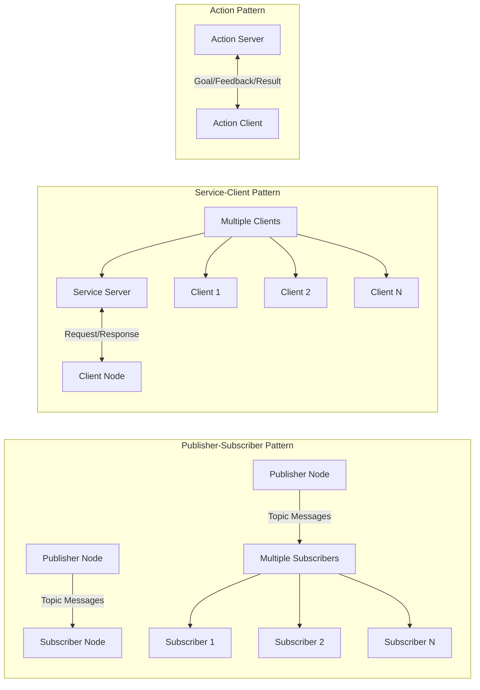

# Communication in ROS 2 (Nodes, Topics, Services)

## Introduction

Communication is the backbone of any robotic system. In ROS 2, communication between different components happens through three primary mechanisms: **Nodes**, **Topics**, and **Services**. Understanding these communication patterns is essential for building distributed robotic systems.

### Communication Patterns Diagram

The following diagram illustrates the main communication patterns in ROS 2:



## Nodes: The Building Blocks

### What is a Node?

A node is an executable process that uses ROS 2 to communicate with other nodes. Nodes are the fundamental building blocks of a ROS 2 system. Each node:
- Performs a specific function (e.g., sensor data processing, motor control)
- Communicates with other nodes through topics, services, or actions
- Is part of a package that can be compiled and executed

### Node Lifecycle

Nodes in ROS 2 have a well-defined lifecycle:
- **Unconfigured**: Node created but not yet configured
- **Inactive**: Node configured but not actively participating
- **Active**: Node running and participating in communication
- **Finalized**: Node shut down cleanly

### Creating Nodes

Nodes can be created in different languages. Here's a basic Python example:

```python
import rclpy
from rclpy.node import Node

class MinimalPublisher(Node):
    def __init__(self):
        super().__init__('minimal_publisher')
        self.publisher = self.create_publisher(String, 'topic', 10)
        timer_period = 0.5  # seconds
        self.timer = self.create_timer(timer_period, self.timer_callback)

    def timer_callback(self):
        msg = String()
        msg.data = 'Hello World: %d' % self.get_clock().now().nanoseconds
        self.publisher.publish(msg)

def main(args=None):
    rclpy.init(args=args)
    minimal_publisher = MinimalPublisher()
    rclpy.spin(minimal_publisher)
    minimal_publisher.destroy_node()
    rclpy.shutdown()

if __name__ == '__main__':
    main()
```

## Topics: Publish/Subscribe Communication

### What are Topics?

Topics implement a **publish/subscribe** communication pattern where:
- Publishers send messages to a topic
- Subscribers receive messages from a topic
- Multiple publishers and subscribers can use the same topic
- Communication is asynchronous and decoupled

### Message Types

ROS 2 comes with predefined message types:
- `std_msgs`: Basic data types (Int32, Float64, String, etc.)
- `geometry_msgs`: Geometric primitives (Point, Pose, Twist, etc.)
- `sensor_msgs`: Sensor data (LaserScan, Image, JointState, etc.)
- `nav_msgs`: Navigation-specific messages (Odometry, Path, OccupancyGrid, etc.)

### Quality of Service (QoS)

QoS settings allow fine-tuning of communication behavior:
- **Reliability**: Reliable (delivery guaranteed) or Best Effort (delivery not guaranteed)
- **Durability**: Volatile (new subscribers don't receive old messages) or Transient Local (new subscribers receive latest messages)
- **History**: Keep Last (only recent messages) or Keep All (all messages)

## Services: Request/Response Communication

### What are Services?

Services implement a **request/response** communication pattern where:
- A client sends a request to a service
- The service processes the request and sends a response back
- Communication is synchronous and blocking
- Useful for operations that require immediate feedback

### Service Example

```python
# Service client example
import rclpy
from rclpy.node import Node
from example_interfaces.srv import AddTwoInts

class MinimalClientAsync(Node):
    def __init__(self):
        super().__init__('minimal_client_async')
        self.cli = self.create_client(AddTwoInts, 'add_two_ints')
        while not self.cli.wait_for_service(timeout_sec=1.0):
            self.get_logger().info('service not available, waiting again...')
        self.req = AddTwoInts.Request()

    def send_request(self, a, b):
        self.req.a = a
        self.req.b = b
        self.future = self.cli.call_async(self.req)
        rclpy.spin_until_future_complete(self, self.future)
        return self.future.result()
```

## Actions: Goal-Based Communication

### What are Actions?

Actions are used for **long-running tasks** with feedback:
- Client sends a goal to an action server
- Server provides feedback during execution
- Server sends result when finished
- Client can cancel the goal if needed

## Best Practices for Communication

### Topic Naming Conventions

- Use forward slashes to separate namespaces: `/robot1/sensors/laser_scan`
- Use lowercase letters and underscores: `joint_states`, `cmd_vel`
- Be descriptive but concise: `front_camera/image_raw` instead of `img`

### Message Design

- Keep messages small and efficient
- Use appropriate data types (avoid unnecessary conversions)
- Consider bandwidth limitations for remote communication
- Design for extensibility (add optional fields rather than changing types)

### Error Handling

- Implement timeouts for service calls
- Handle connection failures gracefully
- Use latching for important static information
- Monitor connection status and handle disconnections

## Exercises

1. **Node Creation**: Create a simple publisher and subscriber node that communicate using a custom message
2. **Service Implementation**: Implement a service that performs a calculation and returns the result
3. **QoS Experimentation**: Test different QoS profiles to understand their impact on communication
4. **Debugging**: Use `ros2 topic echo` and `ros2 service call` to debug communication issues

## Summary

This chapter covered the core communication mechanisms in ROS 2: nodes, topics, and services. Understanding these concepts is essential for building distributed robotic systems that can coordinate effectively. The next chapter will explore how to bridge AI agents to these robotic systems.