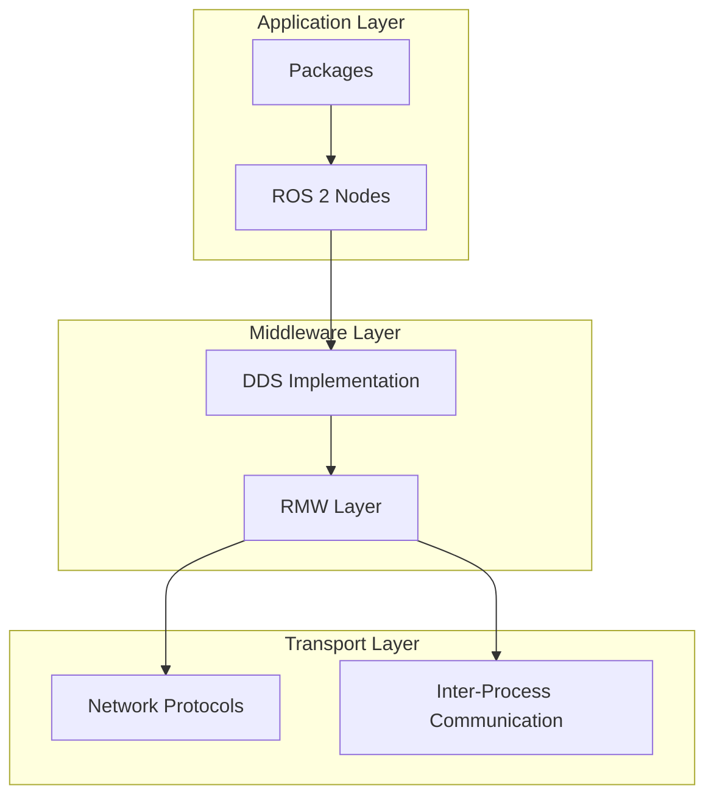

# Foundations of the Robotic Nervous System

## Introduction

The Robot Operating System 2 (ROS 2) serves as the "nervous system" of robotic platforms, providing the middleware and communication infrastructure that allows different components of a robot to work together seamlessly. This chapter introduces the core concepts that make ROS 2 the foundation for modern robotics applications.

## Core Concepts

### What is the Robotic Nervous System?

The robotic nervous system refers to the communication and coordination infrastructure that connects various sensors, actuators, and processing units within a robot. In the context of ROS 2, this system is built around:

- **Decentralized Architecture**: Components run as separate processes that communicate via messages
- **Language Independence**: Nodes can be written in different programming languages (C++, Python, etc.)
- **Hardware Abstraction**: Applications don't need to know the specifics of underlying hardware
- **Message-Based Communication**: All data exchange happens through standardized message formats

### ROS 2 vs. Traditional Systems

Unlike monolithic robotic architectures, ROS 2 provides:
- Modularity: Components can be developed, tested, and replaced independently
- Scalability: New components can be added without disrupting existing functionality
- Debugging: Individual nodes can be monitored and debugged separately
- Reusability: Components can be shared across different robotic platforms

## ROS 2 Architecture Overview

### Architecture Diagram

The ROS 2 architecture provides a flexible middleware for robotic applications:



### DDS (Data Distribution Service)

ROS 2 uses DDS as its underlying communication middleware. DDS provides:
- Publish/Subscribe messaging patterns
- Service/Client request/response patterns
- Discovery mechanisms for nodes to find each other
- Quality of Service (QoS) settings for reliable communication

### Nodes

A node is a single executable process that participates in the ROS 2 computation. Nodes are:
- Lightweight processes that perform specific functions
- Connected to other nodes through topics, services, and actions
- Organized into packages for distribution and reuse

### Packages

Packages are the basic building and distribution unit in ROS 2. They contain:
- Source code (libraries and executables)
- Resource files (meshes, URDFs, textures, etc.)
- Configuration files (launch files, parameters, etc.)
- Documentation and tests

## Setting Up Your ROS 2 Environment

### Installation

ROS 2 should be installed according to your operating system. The most common distributions are:
- **Humble Hawksbill**: Long-term support (LTS) release, recommended for beginners
- **Iron Irwini**: Latest stable release with newer features

### Workspace Structure

A typical ROS 2 workspace follows this structure:
```
workspace_folder/          # e.g., ~/ros2_ws
  src/                     # Source code repositories
    package1/
      CMakeLists.txt       # Build configuration
      package.xml          # Package manifest
      src/                 # Source code files
      include/             # Header files
      launch/              # Launch files
      config/              # Configuration files
```

## Basic ROS 2 Commands

### Environment Setup

```bash
# Source the ROS 2 installation
source /opt/ros/humble/setup.bash

# Or add to your ~/.bashrc to source automatically
echo "source /opt/ros/humble/setup.bash" >> ~/.bashrc
```

### Common Commands

```bash
# Check available nodes
ros2 node list

# Check available topics
ros2 topic list

# Check available services
ros2 service list

# Echo messages on a topic
ros2 topic echo /topic_name std_msgs/msg/String
```

## Exercises

1. **Environment Setup**: Install ROS 2 and verify the installation by running basic commands
2. **Node Exploration**: Use `ros2 node list` and `ros2 topic list` to explore the system
3. **Topic Communication**: Set up a simple publisher-subscriber pair to understand message passing

## Summary

This chapter introduced the fundamental concepts of ROS 2 as the robotic nervous system. Understanding these foundations is crucial for working with more advanced concepts in subsequent chapters.