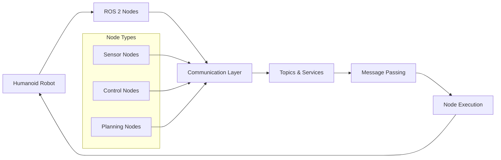

# Module 1: ROS 2 Foundations

## Overview

This module covers the foundational concepts of the Robotic Nervous System using ROS 2 (Robot Operating System 2). Students will learn about the core communication mechanisms that enable robotic systems to function effectively, how to bridge AI agents to robots, and how to define humanoid robots using URDF.

## Learning Objectives

Upon completion of this module, students will be able to:
- Understand and implement the core communication mechanisms in ROS 2 (Nodes, Topics, Services)
- Bridge AI agents to robotic systems using ROS 2 interfaces
- Define humanoid robot models using URDF (Unified Robot Description Format)
- Set up and manage ROS 2 workspaces for humanoid robotics applications

## Module Structure

This module is organized into the following sections:
1. [Foundations of the Robotic Nervous System](./foundations.md) - Core concepts of ROS 2 as the robot's nervous system
2. [Communication in ROS 2](./communication.md) - Detailed exploration of Nodes, Topics, and Services
3. [Bridging AI Agents to Robots](./bridging-ai-robots.md) - Connecting AI systems to robotic platforms with URDF for humanoids

## Prerequisites

- Basic understanding of Python programming
- Familiarity with Linux command line
- Understanding of general robotics concepts

## Core Architecture

Understanding the ROS 2 architecture is fundamental to working with humanoid robotics:

## Next Steps

Begin with the [Foundations of the Robotic Nervous System](./foundations.md) section to understand the core concepts of ROS 2.