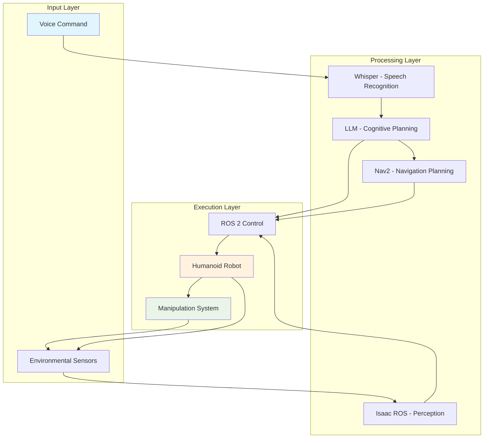

# Autonomous Humanoid Capstone

## Introduction

This chapter integrates all components of the Vision-Language-Action (VLA) pipeline into a complete autonomous humanoid system. It demonstrates how voice recognition, cognitive planning, navigation, detection, and manipulation work together to create a fully autonomous robotic system that responds to natural language commands.

### Complete VLA System Integration

The complete autonomous humanoid system integrates all VLA components:



## Learning Objectives

By the end of this chapter, students will be able to:
- Understand how all VLA components integrate into a complete system
- Explain the complete pipeline from voice recognition to physical manipulation
- Describe state management and coordination in autonomous systems
- Identify integration challenges and solutions in complex robotic systems

## VLA Pipeline Integration Concepts

### Complete System Architecture

The complete VLA pipeline integrates multiple sophisticated systems:

1. **Voice Recognition Layer**: Processes natural language commands using Whisper
2. **Cognitive Planning Layer**: Translates commands into action sequences using LLMs
3. **Navigation Layer**: Plans and executes robot movement using ROS 2 navigation stack
4. **Perception Layer**: Detects and identifies objects using computer vision
5. **Manipulation Layer**: Executes precise physical actions using robot arms/hands

### System Coordination

Successful integration requires careful coordination between components:
- **Message Passing**: Components communicate through ROS 2 topics, services, and actions
- **State Synchronization**: All components maintain consistent understanding of system state
- **Error Propagation**: Errors in one component are properly handled by others
- **Timing Coordination**: Components execute in appropriate sequence and timing

### Feedback Loops

The integrated system includes multiple feedback mechanisms:
- **Perception Feedback**: Verification of action success through sensors
- **Execution Monitoring**: Tracking of action completion and progress
- **Plan Adaptation**: Dynamic replanning when environmental conditions change
- **User Interaction**: Confirmation and clarification requests when needed

## Complete Pipeline: Voice → Plan → Navigate → Detect → Manipulate

### The Complete Sequence

The full VLA pipeline follows this sequence for processing natural language commands:

1. **Voice Input**: User speaks a command (e.g., "Bring me the red cup from the kitchen")
2. **Speech Recognition**: Whisper converts speech to text
3. **Cognitive Planning**: LLM generates action sequence
4. **Navigation**: Robot moves to required location (kitchen)
5. **Detection**: Robot identifies and localizes the target object (red cup)
6. **Manipulation**: Robot grasps and transports the object
7. **Delivery**: Robot returns to user and presents the object

### Detailed Pipeline Flow

```
User Command: "Please bring me the red cup from the kitchen"
                    ↓
        [Voice Recognition: "bring me the red cup from the kitchen"]
                    ↓
        [Cognitive Plan: Navigate → Detect → Manipulate → Navigate]
                    ↓
        [Navigation: Move to kitchen location]
                    ↓
        [Detection: Identify red cup among objects]
                    ↓
        [Manipulation: Grasp and lift the red cup]
                    ↓
        [Navigation: Return to user location]
                    ↓
        [Delivery: Present cup to user]
```

### Pipeline Coordination Challenges

Several challenges arise in coordinating the complete pipeline:

- **Uncertainty Management**: Each stage introduces potential errors that must be handled
- **State Tracking**: System must maintain accurate state across all pipeline stages
- **Recovery Mechanisms**: Failed stages require appropriate fallback behaviors
- **Timing Constraints**: Some operations must complete within specific time windows

## State Management for Autonomous Systems

### System State Representation

Autonomous humanoid systems maintain multiple state representations:

- **Robot State**: Position, orientation, battery level, system health
- **World State**: Object locations, environment map, obstacle positions
- **Task State**: Current goal, subtask progress, plan execution status
- **Interaction State**: User context, communication history, preferences

### State Transition Management

The system must handle state transitions carefully:

- **Initialization**: System starts in known safe state
- **Execution**: State updates based on action outcomes
- **Error Recovery**: Transitions to safe state when errors occur
- **Goal Achievement**: Transitions to completion state when task finished

### Example State Machine

```
[Idle] → [Voice Recognition] → [Planning] → [Execution]
   ↑                                    ↓
[Completed] ← [Recovery] ← [Error] ← [Monitoring]
```

### Context Preservation

During long-running tasks, the system must preserve important context:
- User identity and preferences
- Task history and intermediate results
- Environmental changes during execution
- Partial progress information for recovery

## Exercises

1. **System Integration**: Design a state machine diagram for an autonomous humanoid robot that can fetch objects based on voice commands, including error recovery paths.

2. **Pipeline Analysis**: Identify three potential failure points in the complete VLA pipeline and propose recovery strategies for each.

3. **Coordination Challenge**: Describe how the system should handle a situation where the target object is moved during task execution.

## Summary

This capstone chapter demonstrated the complete integration of the Vision-Language-Action pipeline. Understanding how all components work together is essential for developing truly autonomous robotic systems that can respond to natural language commands in real-world environments.