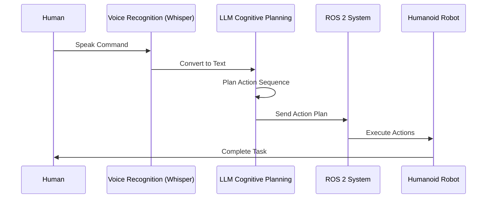

# Vision-Language-Action (VLA) System

Welcome to the Vision-Language-Action (VLA) System module! This section covers how Large Language Models (LLMs) connect language, perception, and robot actions through voice recognition, cognitive planning, and autonomous execution.

## Overview

The VLA system represents a breakthrough in human-robot interaction, enabling natural language communication with robotic systems. This module explores the complete pipeline from voice commands to physical actions:

- **Voice Recognition**: Converting speech to structured commands using Whisper
- **Cognitive Planning**: Translating natural language to action plans using LLMs
- **Autonomous Execution**: Coordinating navigation, detection, and manipulation

## Learning Path

We recommend following these chapters in order:

1. [Voice-to-Action Conversion](./voice-to-action.md) - Understanding how speech becomes robot commands
2. [Cognitive Planning with LLMs](./cognitive-planning.md) - How AI translates language to action sequences
3. [Autonomous Humanoid Capstone](./autonomous-humanoid.md) - Complete system integration and real-world applications

## Key Concepts

- **Multimodal Integration**: Combining vision, language, and action in a unified system
- **Natural Language Understanding**: Processing human instructions for robotic execution
- **Autonomous Decision Making**: Planning and executing complex tasks without human intervention
- **Error Handling and Recovery**: Managing uncertainties in real-world environments

## Prerequisites

Before diving into this module, ensure you have:
- Basic understanding of robotics concepts
- Familiarity with ROS 2 (Robot Operating System)
- Basic programming skills in Python
- Understanding of AI/ML concepts

## VLA Workflow

The Vision-Language-Action system creates a complete pipeline from voice commands to robot actions:

## Next Steps

Start with the [Voice-to-Action Conversion](./voice-to-action.md) chapter to understand the foundation of the VLA system.