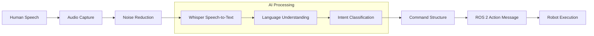

# Voice-to-Action Conversion

## Introduction

This chapter explores how voice recognition technology, specifically OpenAI's Whisper, converts spoken language into structured commands that can be processed by robotic systems. Understanding this conversion process is fundamental to the Vision-Language-Action (VLA) pipeline, as it represents the first step in transforming human language into robot actions.

### Voice Processing Pipeline

The voice-to-action pipeline transforms speech into executable commands:



## Learning Objectives

By the end of this chapter, students will be able to:
- Explain how Whisper processes spoken language for robotics applications
- Understand the conversion from speech to structured text commands
- Identify accuracy considerations in voice recognition for robotics
- Describe the mapping between spoken language and robot commands

## Speech-to-Text Conversion Concepts

### Overview of Whisper Technology

Whisper is an open-source automatic speech recognition (ASR) system developed by OpenAI. It's capable of transcribing speech to text with high accuracy across multiple languages and dialects. For robotics applications, Whisper provides a robust foundation for voice command processing.

Key features of Whisper relevant to robotics:
- High accuracy in transcribing spoken commands
- Ability to handle various audio formats and qualities
- Support for domain-specific vocabulary training
- Integration capabilities with ROS 2 and other robotic frameworks

### The Conversion Process

The process of converting speech to structured commands involves several stages:

1. **Audio Input**: Capturing spoken commands through microphones or audio input devices
2. **Preprocessing**: Cleaning and normalizing the audio signal
3. **Transcription**: Converting speech to text using Whisper's ASR capabilities
4. **Structured Command Generation**: Mapping the transcribed text to robot-appropriate commands

### Robotics Command Vocabulary

When using Whisper for robotics applications, it's important to consider the specific vocabulary and command structure that will be most effective:

- Simple, clear commands work best (e.g., "Move forward", "Turn left", "Pick up the red cup")
- Consistent command patterns improve recognition accuracy
- Domain-specific terminology may require additional training or prompting

## Structured Command Generation

### Mapping Natural Language to Robot Actions

The conversion from transcribed speech to structured commands involves mapping natural language to specific robot actions. This process typically involves:

- **Intent Recognition**: Identifying the intended action from the spoken command
- **Parameter Extraction**: Extracting relevant parameters (e.g., object properties, locations)
- **Command Structuring**: Organizing the intent and parameters into a structured format

### Example Conversion Process

Consider the spoken command: "Please go to the kitchen and bring me the red cup"

The structured command might look like:
```json
{
  "action_sequence": [
    {
      "action": "navigate",
      "target": "kitchen"
    },
    {
      "action": "detect",
      "object": "cup",
      "color": "red"
    },
    {
      "action": "manipulate",
      "operation": "grasp",
      "object": "red cup"
    },
    {
      "action": "navigate",
      "target": "user"
    }
  ]
}
```

## Voice Recognition Accuracy Considerations

### Factors Affecting Accuracy

Several factors can impact the accuracy of voice recognition in robotics applications:

- **Environmental Noise**: Background sounds can interfere with command recognition
- **Audio Quality**: Microphone quality and positioning affect recognition accuracy
- **Speaker Characteristics**: Accent, speaking rate, and vocal characteristics
- **Distance**: The distance between the speaker and microphone
- **Domain Specificity**: Vocabulary and context relevance

### Improving Recognition Accuracy

To improve voice recognition accuracy in robotics:

- Use noise-cancelling microphones when possible
- Implement voice activity detection to isolate commands
- Consider speaker adaptation techniques for specific users
- Use context-aware language models that understand robotics commands
- Implement confirmation mechanisms for critical commands

### Error Handling and Validation

Since voice recognition is not 100% accurate, it's important to implement error handling:

- Confidence scoring for recognition results
- Confirmation prompts for ambiguous commands
- Fallback mechanisms when recognition fails
- User feedback to improve future recognition

## Exercises

1. **Conceptual Understanding**: Explain the difference between speech recognition and structured command generation in the context of robotics.

2. **Command Design**: Design a simple voice command vocabulary for a basic mobile robot that can move, detect objects, and manipulate items.

3. **Accuracy Analysis**: Identify three potential sources of error in voice recognition for robotics and propose mitigation strategies for each.

## Summary

This chapter covered the fundamental concepts of converting voice commands to structured robot commands using Whisper technology. Understanding this process is crucial for implementing the complete VLA pipeline, as it provides the entry point for natural language interaction with robotic systems.